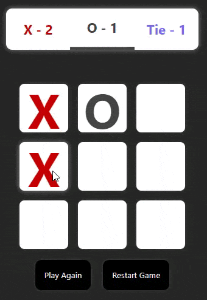

<p align="center">
 <a href="#Description">Description</a> |
 <a href="#Technologies">Technologies</a> |
 <a href="#How to use">How to use</a> |
 <a href="#Software">Software</a> |
 <a href="#License">License</a> |
 <a href="#MyLinkedIn">My LinkedIn</a>
</p>

<div align="center">

# Tic-Tac-Toe Game



</div>

<div id="Description">

## Description

This is a simple Tic-Tac-Toe game built using Vite and React.js. It allows two players to take turns marking their symbol (X or O) on a 3x3 grid. The player who succeeds in placing three of their symbols in a horizontal, vertical, or diagonal row wins the game.

</div>

<div id="Characteristics">

## Characteristics:

- useStates;
- Vite;
- Components;
- JavaScript;

</div>
<div id="Technologies">

## Technologies:

- Vite: A fast build tool for modern web development.
- React.js: A JavaScript library for building user interfaces.

</div>
<div id="How to use">

## How to use:

Before you begin, make sure you have Node.js and npm (Node Package Manager) installed on your machine.

#### Clone this repository

```bash
$ git clone [https://github.com/arks-lacerda/](https://github.com/arks-lacerda/)
```

#### Access project folder in terminal/cmd

```bash
$ cd /ticTacToe
```

#### Install the dependencies

```bash
$ npm install
```

#### Run the application in development mode

```bash
$ npm run dev
```

#### The app will run on the port:5173 - go to <http://localhost:5173>

</div>
<div id="Software">

## Software

[VSCode](https://insiders.vscode.dev/)

</div>
<div id="License">

## 📝 License

This project is under the [MIT]() license. See the LICENSE file for more details.

</div>
<div id="MyLinkedIn">

## 🔎 My LinkedIn

<a href="https://www.linkedin.com/in/arks-lacerda/"></a>

<h3 align="center">Developed by Arthur Lacerda ☕</h3>
</div>
